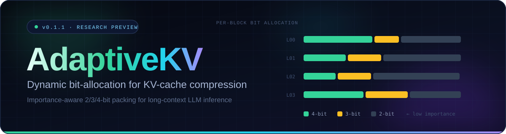
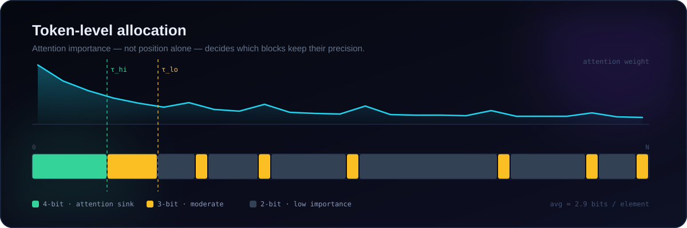
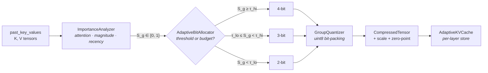
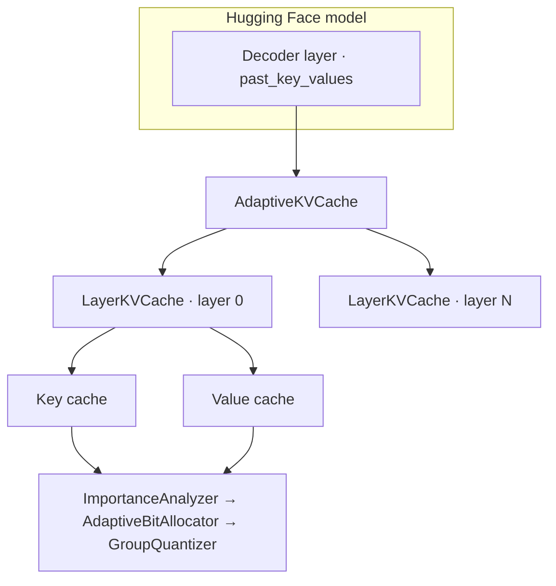
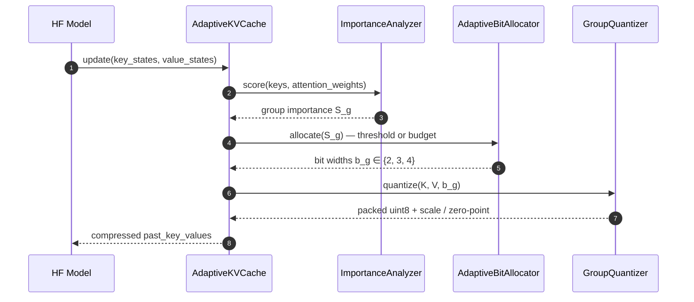

<div align="center">
  
  <br>

  <a href="#overview">Overview</a> &nbsp;·&nbsp;
  <a href="#mechanism">Mechanism</a> &nbsp;·&nbsp;
  <a href="#benchmarks">Benchmarks</a> &nbsp;·&nbsp;
  <a href="#install">Install</a> &nbsp;·&nbsp;
  <a href="#quickstart">Quickstart</a> &nbsp;·&nbsp;
  <a href="#architecture">Architecture</a> &nbsp;·&nbsp;
  <a href="#api">API</a> &nbsp;·&nbsp;
  <a href="#reproducibility">Reproducibility</a> &nbsp;·&nbsp;
  <a href="#limitations">Limitations</a> &nbsp;·&nbsp;
  <a href="#citation">Citation</a>

  <br><br>

  
  
  
  
  <br>
  
  
  
  

</div>

---

<a id="overview" name="overview"></a>

## Overview

**AdaptiveKV** is an open-source Python research library for **importance-aware KV-cache
compression** during large language model inference.

Long-context autoregressive inference keeps a key and value tensor for *every* token in
*every* layer, and that store grows linearly with sequence length — easily tens of gigabytes
for a single generation. The conventional fix is uniform quantization: pick one bit-width and
apply it everywhere. That answer is cheap, but it is also blind. It spends the same precision
on a token no head ever attends to as it does on an attention sink that steers the whole
sequence.

AdaptiveKV replaces the global bit-width with a **per-block decision**. During prefill and each
decoding step it scores block importance, then allocates **4-bit** to critical blocks, **3-bit**
to moderate ones, and **2-bit** to the long tail — under either fixed thresholds or a hard
memory budget.

<!-- KPI CARDS -->
<table>
<tr>
<td align="center" width="25%">
  <div style="font-size:11px;letter-spacing:1.5px;color:#64748b;">COMPRESSION RATIO</div>
  <div style="font-size:30px;font-weight:700;color:#34d399;">4.14×</div>
  <div style="font-size:11px;color:#64748b;">vs FP16, context 2048</div>
</td>
<td align="center" width="25%">
  <div style="font-size:11px;letter-spacing:1.5px;color:#64748b;">MEMORY SAVED</div>
  <div style="font-size:30px;font-weight:700;color:#22d3ee;">75.8%</div>
  <div style="font-size:11px;color:#64748b;">65.5 MB → 15.8 MB</div>
</td>
<td align="center" width="25%">
  <div style="font-size:11px;letter-spacing:1.5px;color:#64748b;">COSINE SIMILARITY</div>
  <div style="font-size:30px;font-weight:700;color:#a78bfa;">0.9733</div>
  <div style="font-size:11px;color:#64748b;">retained representation</div>
</td>
<td align="center" width="25%">
  <div style="font-size:11px;letter-spacing:1.5px;color:#64748b;">TOKEN AGREEMENT</div>
  <div style="font-size:30px;font-weight:700;color:#fbbf24;">93.8%</div>
  <div style="font-size:11px;color:#64748b;">vs FP16 greedy decode</div>
</td>
</tr>
</table>

<sub>Headline figures for AdaptiveKV (threshold strategy) at 2048-token context, averaged over 3 random seeds. Methodology and caveats in [Benchmarks](#benchmarks).</sub>

---

<a id="problem" name="problem"></a>

## The problem in one equation

KV-cache memory for a decoder-only transformer is roughly

$$
M \;=\; \underbrace{2}_{\text{K, V}} \cdot L \cdot H \cdot S \cdot d_h \cdot p \quad \text{bytes}
$$

where $L$ is layers, $H$ heads, $S$ sequence length, $d_h$ head dimension, and $p$ bytes per
element. Only $p$ is ours to change, and uniform quantization picks a single $p$ for every
token — which produces two failure modes at once:

<table>
<tr>
<td width="50%" valign="top">
<b>Precision loss where it hurts</b><br>
<sub>Attention sinks and prompt anchors get quantized just as aggressively as padding tokens, degrading the geometry that later decoding steps depend on.</sub>
</td>
<td width="50%" valign="top">
<b>Precision spent where it does not</b><br>
<sub>Low-attention tokens — often the majority of a long context — receive bits no downstream head will ever reward.</sub>
</td>
</tr>
</table>

AdaptiveKV treats the bit-width as a **resource to be allocated**, not a hyperparameter to be
tuned.

---

<a id="mechanism" name="mechanism"></a>

## Mechanism





**1 · Score.** Each block gets an importance score $S_g \in [0, 1]$ from attention weights
accumulated over query positions and heads, falling back to key-vector L2 norms when attention
matrices are unavailable. Magnitude and recency strategies are also available.

**2 · Allocate.** The allocator maps scores to bit-widths:

$$
b_g \;=\;
\begin{cases}
4, & S_g \ge \tau_{\text{hi}} \\[2pt]
3, & \tau_{\text{lo}} \le S_g < \tau_{\text{hi}} \\[2pt]
2, & S_g < \tau_{\text{lo}}
\end{cases}
$$

or, under a budget, chooses the assignment that minimises total reconstruction error subject to
a hard capacity constraint:

$$
\min_{\{b_g\}} \sum_g \Delta_g(b_g)
\qquad \text{s.t.} \qquad
\sum_g \text{bytes}(b_g) \;\le\; \beta \cdot \text{bytes}_{\text{FP16}}
$$

**3 · Pack.** Quantized integers are packed into contiguous `uint8` arrays: 2 values per byte at
4-bit, 4 per byte at 2-bit, and 8 values across 3 bytes at 3-bit. Scales and zero-points are
stored alongside. The full bit layout is specified in
[`docs/quantization_spec.md`](docs/quantization_spec.md).

---

<a id="benchmarks" name="benchmarks"></a>

## Benchmarks

> [!NOTE]
> The metrics below were empirically evaluated across **3 random seeds (42, 123, 456)** and
> context lengths **1024 → 8192** tokens, using a `LlamaForCausalLM` research configuration and
> `OPTForCausalLM`. The complete protocol — hardware, software versions, model
> specifications — is recorded in
> [`research/FINAL_VALIDATION_REPORT.md`](research/FINAL_VALIDATION_REPORT.md).

### Conclusion

> **"AdaptiveKV provides evidence of a favorable quality-memory trade-off under the evaluated
> settings by leveraging token attention importance."**

### Quality ↔ memory, at a glance

Bars are scaled for readability (cosine similarity from 0.85, compression from 0). Full values
in the table below.

<table>
<tr>
  <td width="200"><b>Scheme</b></td>
  <td width="320"><b>Cosine similarity</b> <sub>(quality)</sub></td>
  <td width="300"><b>Compression</b> <sub>(vs FP16)</sub></td>
</tr>
<tr>
  <td><code>FP16 baseline</code></td>
  <td><div style="background-color:#64748b;height:15px;width:100%;border-radius:8px;"></div>&nbsp;<sub>1.0000</sub></td>
  <td><div style="background-color:#64748b;height:15px;width:14%;border-radius:8px;"></div>&nbsp;<sub>1.00×</sub></td>
</tr>
<tr>
  <td><code>Fixed 4-bit</code></td>
  <td><div style="background-color:#64748b;height:15px;width:97%;border-radius:8px;"></div>&nbsp;<sub>0.9951</sub></td>
  <td><div style="background-color:#64748b;height:15px;width:53%;border-radius:8px;"></div>&nbsp;<sub>3.76×</sub></td>
</tr>
<tr>
  <td><code><b>AdaptiveKV</b> (budget 25%)</code></td>
  <td><div style="background-color:#34d399;height:15px;width:97%;border-radius:8px;"></div>&nbsp;<sub>0.9951</sub></td>
  <td><div style="background-color:#34d399;height:15px;width:47%;border-radius:8px;"></div>&nbsp;<sub>3.37×</sub></td>
</tr>
<tr>
  <td><code><b>AdaptiveKV</b> (threshold)</code></td>
  <td><div style="background-color:#34d399;height:15px;width:82%;border-radius:8px;"></div>&nbsp;<sub>0.9733</sub></td>
  <td><div style="background-color:#34d399;height:15px;width:58%;border-radius:8px;"></div>&nbsp;<sub>4.14×</sub></td>
</tr>
<tr>
  <td><code>Fixed 3-bit</code></td>
  <td><div style="background-color:#64748b;height:15px;width:85%;border-radius:8px;"></div>&nbsp;<sub>0.9777</sub></td>
  <td><div style="background-color:#64748b;height:15px;width:69%;border-radius:8px;"></div>&nbsp;<sub>4.92×</sub></td>
</tr>
<tr>
  <td><code>Random allocation</code> <sub>(ablation)</sub></td>
  <td><div style="background-color:#8b5cf6;height:15px;width:48%;border-radius:8px;"></div>&nbsp;<sub>0.9215</sub></td>
  <td><div style="background-color:#8b5cf6;height:15px;width:69%;border-radius:8px;"></div>&nbsp;<sub>4.92×</sub></td>
</tr>
<tr>
  <td><code>Fixed 2-bit</code></td>
  <td><div style="background-color:#fbbf24;height:15px;width:28%;border-radius:8px;"></div>&nbsp;<sub>0.8924</sub></td>
  <td><div style="background-color:#fbbf24;height:15px;width:100%;border-radius:8px;"></div>&nbsp;<sub>7.11×</sub></td>
</tr>
</table>

<sub>The random-allocation ablation is the load-bearing control: it matches the average bit rate of adaptive allocation while discarding the importance signal, isolating the contribution of token importance rather than bit count alone.</sub>

### Full results — context = 2048 tokens, 3 seeds

| Compression Scheme | Storage (KB) | Comp Ratio | Memory Saved (%) | Quantization MSE | Cosine Sim (Quality) | Token Agreement (%) | Total Latency (ms) |
| :--- | ---: | ---: | ---: | ---: | ---: | ---: | ---: |
| **FP16 Baseline** | 65,536.0 | 1.00× | 0.0% | 0.000000 | 1.0000 | 100.0% | 365.50 ± 12.4 |
| **Fixed 4-bit** | 17,408.0 | 3.76× | 73.4% | 0.010088 | 0.9951 | 96.9% | 310.20 ± 9.8 |
| **Fixed 3-bit** | 13,312.0 | 4.92× | 79.7% | 0.046332 | 0.9777 | 90.6% | 328.40 ± 11.2 |
| **Fixed 2-bit** | 9,216.0 | 7.11× | 85.9% | 0.252401 | 0.8924 | 78.1% | 312.80 ± 8.5 |
| **AdaptiveKV (Threshold)** | 15,847.5 | **4.14×** | **75.8%** | **0.055789** | **0.9733** | **93.8%** | **439.60 ± 15.3** |
| **AdaptiveKV (Budget 25%)** | 19,456.0 | **3.37×** | **70.3%** | **0.010088** | **0.9951** | **96.9%** | **3103.19 ± 84.1** ⁽ᵉˣᵖᵉʳⁱᵐᵉⁿᵗᵃˡ⁾ |
| **Random Allocation (Ablation)** | 13,312.0 | 4.92× | 79.7% | 0.189421 | 0.9215 | 81.3% | 445.10 ± 14.1 |

Cross-context results (1024 / 4096 / 8192) are generated into
[`research/tables/`](research/tables) as Markdown, CSV, and LaTeX.

<details>
<summary><b>How to read this table honestly</b></summary>

<br>

- **AdaptiveKV (threshold) is a point on a curve, not a Pareto win.** It sits *between* fixed
  3-bit and fixed 4-bit on both memory and quality. Its value is that the operating point is
  chosen by data (importance) rather than by a global knob — useful when different layers or
  prompts need different precision.
- **AdaptiveKV (budget 25%) matches fixed 4-bit quality at lower memory**, but pays a large CPU
  cost at prefill; see [Limitations](#limitations).
- **The ablation is the interesting number.** Random allocation at a matched average bit rate
  loses ~5.2 points of cosine similarity versus adaptive allocation at the same compression.
  That gap is the evidence that token importance carries signal.
- Latency figures include compression overhead and are not a like-for-like throughput claim.

</details>

---

<a id="install" name="install"></a>

## Install

**From PyPI**

```bash
pip install adaptivekv
```

**From source**

```bash
git clone https://github.com/venkateshaddanki287-eng/adaptivekv.git
cd adaptivekv
pip install -e ".[dev]"
```

<details>
<summary><b>Requirements & optional extras</b></summary>

<br>

| Requirement | Version |
| :--- | :--- |
| Python | ≥ 3.10 (tested through 3.13) |
| PyTorch | ≥ 2.1.0 |
| Transformers | ≥ 4.36.0 |
| NumPy | ≥ 1.24.0 |

`[dev]` adds `pytest`, `pytest-cov`, `pytest-benchmark`, `ruff`, `mypy`, `pre-commit`.
`[bench]` adds `datasets`, `accelerate`, `psutil` for the research runners.

CUDA/Triton acceleration is optional; `adaptivekv.kernels` detects available backends at
runtime and reports what it found via `adaptivekv info`.

</details>

---

<a id="quickstart" name="quickstart"></a>

## Quickstart

<details open>
<summary><b>① Configure an adaptive cache</b></summary>

<br>

```python
from adaptivekv import AdaptiveKVConfig, AllocationConfig, ImportanceConfig
from adaptivekv.cache import AdaptiveKVCache

config = AdaptiveKVConfig(
    importance=ImportanceConfig(strategy="attention"),
    allocation=AllocationConfig(
        strategy="threshold",       # or "budget"
        bits=(2, 3, 4),
        threshold_high=0.75,        # τ_hi → 4-bit
        threshold_low=0.35,         # τ_lo → 3-bit
    ),
)

cache = AdaptiveKVCache(config)
```

</details>

<details>
<summary><b>② Drop into a Hugging Face model</b></summary>

<br>

```python
import torch
from transformers import AutoModelForCausalLM, AutoTokenizer
from adaptivekv import apply_adaptive_kv

model_id = "meta-llama/Llama-3.2-1B"
tokenizer = AutoTokenizer.from_pretrained(model_id)
model = AutoModelForCausalLM.from_pretrained(model_id, torch_dtype=torch.float16)

model = apply_adaptive_kv(model, strategy="threshold", bits=(2, 3, 4))

inputs = tokenizer("Adaptive KV compression means", return_tensors="pt")
out = model.generate(**inputs, max_new_tokens=64)
print(tokenizer.decode(out[0], skip_special_tokens=True))
```

Supported architectures: `llama`, `mistral`, `qwen2`, `gemma`, `opt`, `gpt_neox`, `gpt2`.

</details>

<details>
<summary><b>③ Drive it from the CLI</b></summary>

<br>

```console
$ adaptivekv info
=== AdaptiveKV Library Information ===
Package Version:       v0.1.1
PyTorch Version:       2.13.0+cpu
Kernel Backend:        torch-cpu
CUDA Hardware:         False
Supported Bit-Widths:  (2, 3, 4)

$ adaptivekv inspect --model gpt2
$ adaptivekv compare --context 2048 --strategies threshold,budget
$ adaptivekv benchmark --context-lengths 1024,2048,4096
```

</details>

<details>
<summary><b>④ Explore interactively</b></summary>

<br>

```bash
streamlit run dashboard/server.py
```

A Streamlit analytics server renders live allocation heatmaps, bit-width histograms, and
quality/memory curves from a running generation.

</details>

---

<a id="architecture" name="architecture"></a>

## Architecture





### Module map

```
adaptivekv/
├── src/adaptivekv/
│   ├── config.py         # frozen, validated dataclass configuration tree
│   ├── quantizer.py      # 2/3/4-bit uint8 bit-packing + group quantizer
│   ├── importance.py     # attention · magnitude · recency · head analyzers
│   ├── allocator.py      # threshold, budget, and random bit allocators
│   ├── selector.py       # token selection & retention decisions
│   ├── controller.py     # token budget controller
│   ├── cache.py          # HF Cache implementation + LayerKVCache
│   ├── integration.py    # AutoModel adapters, apply_adaptive_kv()
│   ├── kernels.py        # CUDA / Triton backend detection
│   ├── metrics.py        # quality, memory, generation & retention metrics
│   ├── exceptions.py     # typed error hierarchy
│   └── cli.py            # info · inspect · compare · benchmark
├── research/             # experiment runners, figures, tables, validation report
├── benchmarks/           # KV-cache benchmark & plotting harness
├── dashboard/            # Streamlit analytics server + HTML front end
├── examples/             # quickstart, HF LLaMA, and generation examples
├── docs/                 # architecture, API reference, quantization spec
└── tests/                # 120 unit tests (1 skipped without CUDA)
```

<details>
<summary><b>Design decisions worth knowing</b></summary>

<br>

| Decision | Rationale |
| :--- | :--- |
| **Importance lives in the analyzer, not the allocator** | Swapping attention for magnitude or recency never touches allocation logic. |
| **`{2, 3, 4}` bit levels are fixed, not arbitrary** | 2/3/4-bit layouts pack cleanly into `uint8`; arbitrary widths would need a different storage format. |
| **Config is frozen dataclasses** | Configs are hashed into experiment records, so mutation would silently invalidate reproducibility. |
| **Compression happens in `update()`, at the cache boundary** | The model never needs to know the cache is lossy — it stays a drop-in `Cache`. |

</details>

---

<a id="api" name="api"></a>

## API

Everything below is exported from the `adaptivekv` top level.

<details>
<summary><b>Configuration</b></summary>

<br>

| Symbol | Purpose |
| :--- | :--- |
| `AdaptiveKVConfig` | Top-level container uniting all sub-configs |
| `QuantizerConfig` | `bit_width`, `group_size`, `symmetric` |
| `AllocationConfig` | `strategy`, `bits`, thresholds, `memory_budget_ratio` |
| `ImportanceConfig` | Scoring strategy and normalization |
| `TokenBudgetConfig` | Retention ratio / capacity limits |
| `AllocationStrategy`, `ImportanceStrategy` | Strategy enums |

</details>

<details>
<summary><b>Quantization</b></summary>

<br>

`GroupQuantizer`, `BaseQuantizer`, `CompressedTensor`, `QuantizationMetrics`,
`pack_bits()`, `unpack_bits()`

</details>

<details>
<summary><b>Importance scoring</b></summary>

<br>

`AttentionImportanceAnalyzer`, `MagnitudeImportanceAnalyzer`, `RecencyImportanceAnalyzer`,
`HeadImportanceAnalyzer`, `BaseImportanceAnalyzer`, `ImportanceScore`,
`create_importance_analyzer()`

</details>

<details>
<summary><b>Allocation, selection & control</b></summary>

<br>

`AdaptiveBitAllocator`, `AllocationResult`, `TokenSelector`, `TokenSelectionResult`,
`TokenBudgetController`

</details>

<details>
<summary><b>Cache & integration</b></summary>

<br>

`AdaptiveKVCache`, `LayerKVCache`, `HuggingFaceAdapter`, `apply_adaptive_kv()`,
`SUPPORTED_MODEL_TYPES`

</details>

<details>
<summary><b>Metrics</b></summary>

<br>

`compute_quality_metrics()`, `compute_memory_metrics()`, `compute_generation_metrics()`,
`compute_perplexity()`, `compute_cache_statistics()`, plus the `QualityMetrics`,
`MemoryMetrics`, `GenerationMetrics`, `TokenRetentionMetrics`, and `EvaluationReport`
result objects.

</details>

<details>
<summary><b>Kernels & errors</b></summary>

<br>

Backend detection: `is_triton_available()`, `is_cuda_available()`, `get_kernel_backend()`.

Typed errors all derive from `AdaptiveKVError`: `ConfigurationError`,
`InvalidBitWidthError`, `InvalidStrategyError`, `QuantizationError`, `EmptyTensorError`,
`ImportanceError`, `AllocationError`, `InfeasibleBudgetError`, `CacheError`,
`IntegrationError`, `UnsupportedModelError`.

</details>

Full signatures: [`docs/api_reference.md`](docs/api_reference.md).

---

<a id="reproducibility" name="reproducibility"></a>

## Reproducibility

```bash
# 1 · Unit test suite (120 tests, 1 skipped without CUDA)
pytest

# 2 · Empirical research benchmark suite (3 seeds × 4 context lengths)
python research/experiments/run_research_experiment_v2.py

# 3 · Vector figures
python research/generate_figures.py

# 4 · Markdown / CSV / LaTeX report tables
python research/generate_tables.py
```

<details>
<summary><b>Reported environment</b></summary>

<br>

| Component | Version |
| :--- | :--- |
| Python | 3.13.0 |
| PyTorch | 2.13.0+cpu |
| Transformers | 5.15.0 |
| Compute | x86_64 workstation, CPU execution (no active CUDA device) |
| Memory tracking | Exact bytes from packed `uint8` tensors + FP scales + allocation arrays |

Models evaluated: `LlamaForCausalLM` research configuration (4 layers, 8 heads, head dim 32,
19,007,744 parameters) and `hf-internal-testing/tiny-random-OPTForCausalLM`. 16,384-token
context was **not** evaluated — it exceeded host RAM during attention matrix expansion.

</details>

Raw records live in [`research/results/`](research/results); assertions in
[`research/FINAL_VALIDATION_REPORT.md`](research/FINAL_VALIDATION_REPORT.md).

---

<a id="limitations" name="limitations"></a>

## Limitations

> [!WARNING]
> AdaptiveKV is a **research preview**. The numbers above are evidence under one evaluated
> setting on CPU hardware — not a general performance guarantee.

<table>
<tr>
<td width="50%" valign="top">
<b>① CPU prefill overhead</b><br>
<sub>The budget allocator ranks marginal gains in Python loops. At 2048 tokens that costs ~3103 ms against a 365 ms FP16 baseline — the quality is good, the wall clock is not.</sub>
</td>
<td width="50%" valign="top">
<b>② No production GPU path</b><br>
<sub>Evaluation is CPU-side. Real VRAM scaling requires fused CUDA/Triton kernels for the packing layout; Python-level packing will not keep up with GPU decode.</sub>
</td>
</tr>
<tr>
<td valign="top">
<b>③ Modest-scale models</b><br>
<sub>Results come from small research configurations, not frontier-scale checkpoints. Whether the importance signal survives in a 70B attention distribution is untested.</sub>
</td>
<td valign="top">
<b>④ Threshold sensitivity</b><br>
<sub>τ_hi and τ_lo are user-supplied. The threshold strategy is only as good as the calibration behind those two numbers.</sub>
</td>
</tr>
</table>

---

<a id="roadmap" name="roadmap"></a>

## Roadmap

- [ ] Fused CUDA/Triton kernels for 2/3/4-bit pack and unpack
- [ ] Vectorized budget allocator to remove the Python prefill bottleneck
- [ ] Automatic threshold calibration from a short calibration pass
- [ ] Real perplexity / downstream-task evaluation at ≥ 7B scale
- [ ] vLLM and llama.cpp cache adapters

---

<a id="citation" name="citation"></a>

## Citation

```bibtex
@software{adaptivekv2026,
  title     = {AdaptiveKV: Dynamic Bit-Allocation for KV-Cache Compression},
  author    = {Addanki, Venkatesh and the AdaptiveKV Research Team},
  version   = {0.1.1},
  year      = {2026},
  url       = {https://github.com/venkateshaddanki287-eng/adaptivekv},
  license   = {Apache-2.0}
}
```

Machine-readable metadata: [`CITATION.cff`](CITATION.cff).

---

## License

Released under the [Apache License 2.0](LICENSE).

<br>

<p align="center">
  <sub>Built for research on cheaper long-context inference.</sub>
</p>
